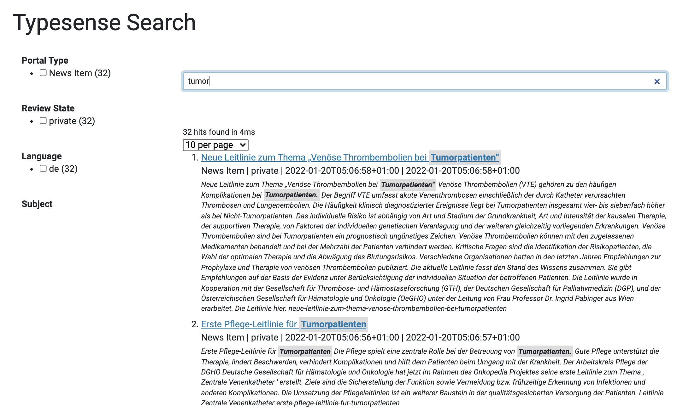

P# zopyx.typesense

## What is zopyx.typesense

`zopyx.typesense` in an add-on for Plone 6 that provides an integration with the
search engine [Typesense](https://typesense.org/). The functionality is similar with `collective.solr`.

The reasons for using Typesense are

- very easy to install (single binary or via Docker)
- multi-field text indexes
- auto-generated (but highly customizable) search UI
- optional facted search for refining fulltext queries
- minimal invasive into Plone (does not replace the ZCatalog)
- very fast search
- extensible and customizable
- scalable (through a Typesense cluster)
- open-source
- on-premise or Typesense cloud (commercial offering)

## Requirements

- Plone 6 (tested)
- Plone 5.2 (untested, support to work for Dexterity-only sites)

## Installation

Add `zopyx.typesense` to your buildout, re-run buildout and install it within Plone.

For Typesense installation, please check the installation docs of Typesense (either for
installation through Docker or through the standalone binary).
  
## Configuration

The `Typesense settings` within the Plone controlpanel:

- `Name of Typesense collection` - must be a unique name for the document pool of your Plone site
- `API Key` - the administrative API key (as configured in Typesense) 
- `Search API Key` - the search API key (as configured in Typesense) 
- `URL of Typesense node X` - the URL(s) of the Typesense node or Typesense cluster
- `Collection schema` - the schema of the Typesense collecton (see Typesense docs)

The `Typesense administration` within the Plone controlpanel:

## Search UI

The search UI is auto-generated from a minimal HTML template which defines the
basic layout together with the widgets to be used [see
here](src/zopyx/typesense/browser/search.pt).

The integration of the template with the Typesense UI generator is impleted
through some lines of Javascript code in
[src/zopyx/typesense/browser/static/app.js](src/zopyx/typesense/browser/static/app.js).

## Transactions and eventual consistency

All indexing/unindexing operations happen asyncronously to Plone and outside
Plone's transaction system.  So, content changes might be available in
Typesense with a short delay. 

## Cavecats

`zopyx.typesense` does not integrate (by-design) with Plone's security and access model.
The main purpose of `zopyx.typesense` is to act as a search engine for public sites.
So it is recommended at this time to index only public content.

## Author

Andreas Jung, info@zopyx.com, www.zopyx.com
