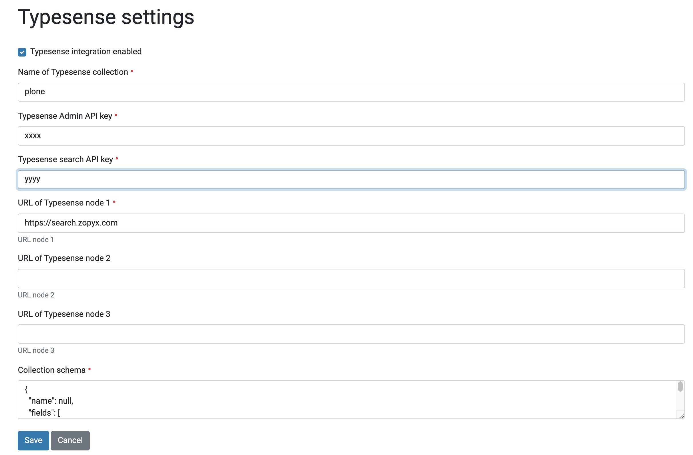

P# zopyx.typesense

## What is zopyx.typesense

`zopyx.typesense` in an add-on for Plone 6 that provides an integration with the
search engine [Typesense](https://typesense.org/). The functionality is similar with `collective.solr`.

The reasons for using Typesense are

- very easy to install (single binary or via Docker)
- multi-field text indexes
- auto-generated (but highly customizable) search UI
- optional facted search for refining fulltext queries
- minimal invasive into Plone (does not replace the ZCatalog)
- very fast search
- extensible and customizable
- scalable (through a Typesense cluster)
- open-source
- on-premise or Typesense cloud (commercial offering)

## Installation

## Configuration

## Search UI

## Transactions and eventual consistency

All indexing/unindexing operations happen asyncronously to Plone and outside
Plone's transaction system.  So, content changes might be available in
Typesense with a short delay. 

## Cavecats

`zopyx.typesense` does not integrate (by-design) with Plone's security and access model.
The main purpose of `zopyx.typesense` is to act as a search engine for public sites.
So it is recommended at this time to index only public content.

## Author

Andreas Jung, info@zopyx.com, www.zopyx.com
